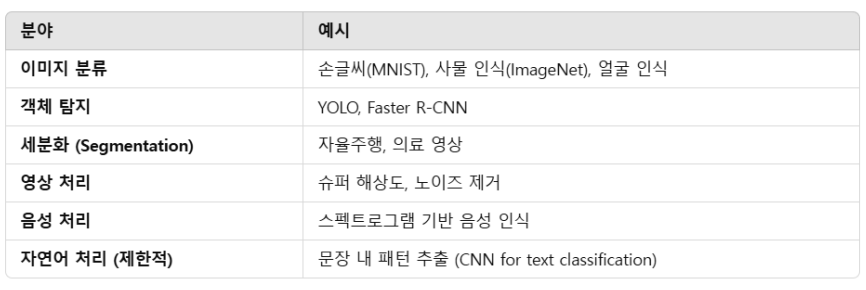
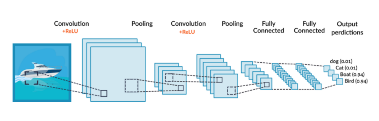
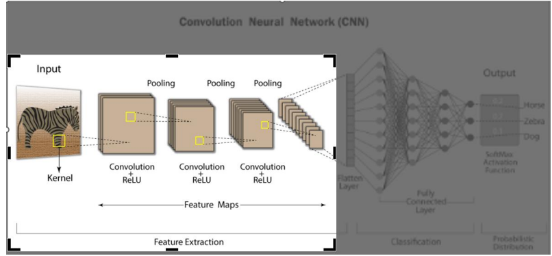
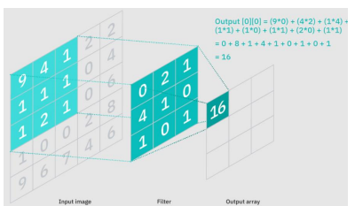
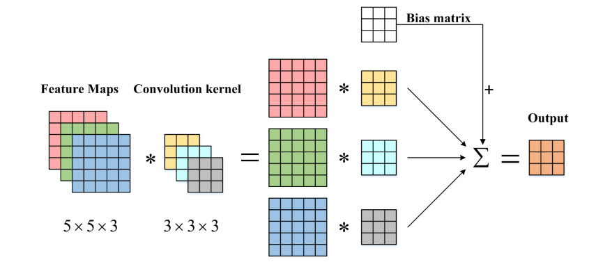
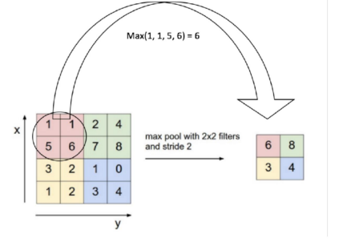
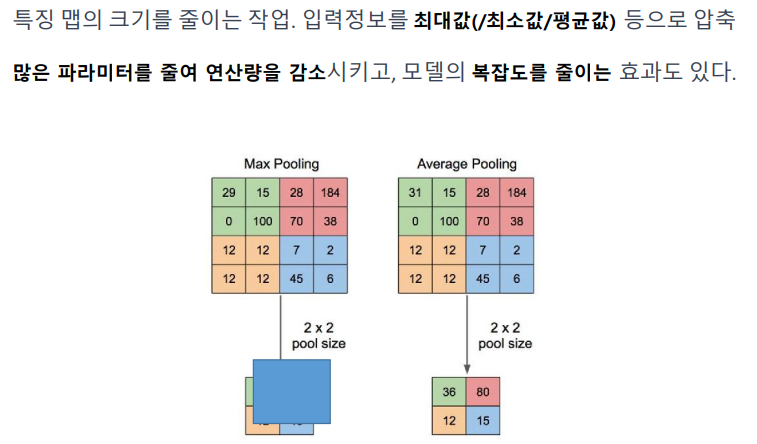
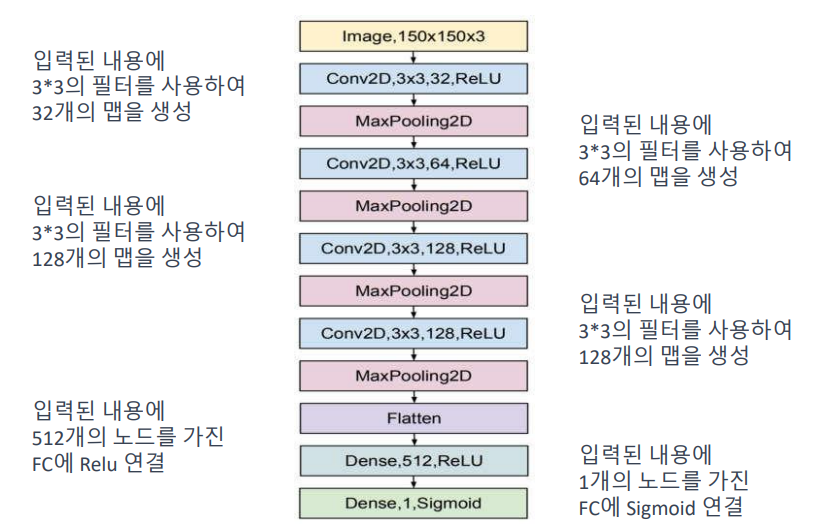

## 🎯 Self-Attention & Multi-Head Attention 총정리

### 1️⃣ Self-Attention이란?

* **정의**: 입력 문장의 각 단어가 다른 단어들과의 **의미적 관련성**을 계산해 문맥을 반영하는 메커니즘
* **역할**: 중요한 단어에 **집중(attend)** 하여 의미 있는 표현 생성
* **수식**:

  $$
  \text{Attention}(Q, K, V) = \text{softmax}\left(\frac{QK^T}{\sqrt{d_k}}\right)V
  $$
* **예시**:
  "민수는 학교에서 지갑을 잃어버렸대" → ‘지갑’은 ‘잃어버렸대’와 높은 attention

---

### 2️⃣ Multi-Head Attention이란?

* **정의**: 여러 개의 Self-Attention을 **병렬로 수행**하여, 문장을 **다양한 시각**에서 해석하는 구조
* **목적**: 하나의 attention만으로는 부족한 복잡한 문맥 정보들을 **다채롭게 포착**
* **수식**:

  $$
  \text{MultiHead}(Q, K, V) = \text{Concat}(\text{head}_1, ..., \text{head}_h)W^O
  $$
* **예시**:
  한 영화에서 Head 1은 줄거리, Head 2는 감정, Head 3은 음악에 집중

---

### 📌 Self vs Multi-Head 요약 비교

| 항목    | Self-Attention | Multi-Head Attention  |
| ----- | -------------- | --------------------- |
| 계산 방식 | 단일 Q-K-V 매핑    | 여러 개의 Q-K-V 병렬 계산     |
| 관점 수  | 하나의 시각         | 여러 시각 (보통 8\~12개)     |
| 장점    | 문맥 반영          | 의미, 문법, 위치 등 다중 정보 포착 |
| 비유    | 대화에서 중요한 단어 집중 | 영화를 다양한 시선으로 감상       |

---

### 🎨 비유로 한 문장 요약

> **Self-Attention**은 문장 안에서 **가장 중요한 말을 골라 듣는 귀**,
> **Multi-Head Attention**은 **여러 명이 같은 문장을 다양한 시선으로 해석하는 과정**이다.

---

## 🧠 Q, K, V란?

### ▶ 정의 요약

| 이름            | 의미            | 역할         |
| ------------- | ------------- | ---------- |
| **Query (Q)** | "내가 찾고 싶은 정보" | 기준점, 주체 역할 |
| **Key (K)**   | "정보가 저장된 열쇠"  | 비교 대상      |
| **Value (V)** | "실제 정보 내용"    | 최종 사용할 정보  |

Self-Attention에서 각 단어는 이 세 가지로 변환되어 사용되며,
**Q와 K의 유사도를 계산**해서 얼마나 중요한지 정하고,
**V에서 필요한 정보를 추출**합니다.

---

## ⚙️ 작동 원리 흐름

### 🔢 1. 입력 임베딩 → Q, K, V 생성

* 각 단어의 임베딩(예: 512차원)을 각각 다른 가중치 행렬에 곱하여 Q, K, V를 만듭니다.

  $$
  Q = XW^Q,\quad K = XW^K,\quad V = XW^V
  $$

### 🔢 2. 어텐션 스코어 계산 (Q·K^T)

* 각 Query 벡터가 모든 Key들과 얼마나 유사한지를 계산 (내적)

### 🔢 3. Softmax로 정규화

* 계산된 점수에 softmax를 적용해 \*\*가중치(주의도)\*\*로 변환

### 🔢 4. 가중치를 Value에 곱해 최종 결과 생성

* 중요도 높은 Value 정보가 최종적으로 강조됨

---

## 📘 예시: 문장 분석

> **"지수는 커피를 마신다."**

각 단어는 Q, K, V로 변환되어 다음과 같은 과정을 겪습니다:

1. `마신다`의 Q가 `커피`의 K와 높은 유사도를 보이면 → `커피`의 V에 높은 가중치 부여
2. `마신다`는 ‘지수’나 ‘는’보다 ‘커피’를 더 중요하게 봄
3. 결과적으로 `마신다`는 \*\*"지수가 마신 건 커피구나"\*\*라는 문맥을 잘 이해하게 됨

---

## 🎨 비유: 도서관에서 책 찾기

* **Query(Q)**: 내가 찾고 싶은 주제 = "우주에 대한 책"
* **Key(K)**: 책 제목과 태그 = 각 책의 키워드 정보
* **Value(V)**: 책의 실제 내용 = 책 속 본문

> Query가 Key와 잘 맞을수록, 그 책(Value)은 내가 보기에 더 중요한 자료가 되는 것!

---

## ✅ Q, K, V 핵심 요약

| 요소            | 실제 의미            | 작동 방식           |
| ------------- | ---------------- | --------------- |
| **Q** (Query) | "내가 뭘 보고 싶은가"    | 입력 단어 기준으로 만들어짐 |
| **K** (Key)   | "내가 참조할 정보들의 기준" | 다른 모든 단어와 비교    |
| **V** (Value) | "실제 정보"          | 중요도에 따라 가중합 처리됨 |

---

## 📌 전체 수식 한눈에 보기

$$
\text{Attention}(Q, K, V) = \text{softmax}\left(\frac{QK^T}{\sqrt{d_k}}\right)V
$$

* $QK^T$: Query와 Key의 유사도
* $\text{softmax}$: 중요도를 확률로 정규화
* 곱한 후 V를 가중합 → 최종 문맥 반영 표현

---

1. CNN 주요 등장 배경
기존 fully connected 신경망의 한계
고차원 이미지 데이터를 그대로 처리할 경우, 파라미터 수가 폭증하여 학습이 어렵고
오버피팅이 심해짐.
공간 구조 인식의 필요성
이미지는 지역적 특징(예: 모서리, 윤곽선)을 갖는데, 기존 MLP는 이를 인식하지 못함.
생물학적 영감
시각피질에서 Receptive Field가 존재한다는 사실에서 착안.
시각 피질의 뉴런이 우리 눈앞의 "작은 조각"들만 먼저 감지하고, 이를 조합하듯
마치 퍼즐을 맞추듯이 작은 정보들을 조합하여 전체적인 의미를 학습
대표적 시초
LeNet-5 (Yann LeCun, 1998): 숫자 인식(MNIST) 문제 해결을 위해 CNN 구조 등장

2. CNN의 컨셉 진화 과정
1). 초기 문제: 기존 신경망의 한계
픽셀 간 관계를 무시하고, 픽셀단위의 학습은 모든 뉴런이 모든 픽셀과 연결되어 파라미터
수가 기하급수적으로 증가하는 문제가 발생
2). 해결의 실마리: 인간의 시각 시스템을 모방
뇌의 시각 피질(Visual Cortex) 에서는 개별 뉴런이 작은 영역(Receptive Field) 을 담당하고, 이
정보들을 결합하여 전체 이미지를 인식
→ 작은 영역을 먼저 분석하는 구조로 만들면 어떨까?
1. CNN 핵심 개념의 발전
Convolution Layer (합성곱 연산), ReLU (비선형성 도입) 정보 손실 방지
Pooling Layer (특징 요약)→ 중요한 정보만 유지하고, 축소하여 연산량 감소
Fully Connected Layer (최종 분류)→ 앞 단계에서 추출한 특징을 기반으로 클래스를 예측
3. 
4. CNN 진화 과정
1) 네트워크 깊이 증가 (LeNet → AlexNet → VGG → ResNet)
초기에는 단순한 구조에서 점점 더 깊고 복잡한 구조로 발전.
하지만 기울기 소실 문제 발생 → ResNet에서 해결.
2) 연산량 최적화 (GoogLeNet, DenseNet, EfficientNet)
단순히 깊이를 늘리는 것이 아니라, 연산 효율과 성능을 모두 고려하는 방향으로 발전.
3) 잔차 학습과 피처 재사용 (ResNet, DenseNet)
깊은 네트워크에서도 학습이 가능하도록 Residual Connection(ResNet), Dense
Connection(DenseNet) 개념 등장.
4) 최적의 네트워크 확장 (EfficientNet)
너비, 깊이, 해상도를 동시에 조절하여 최적의 성능을 찾는 기법 도입.
5.CNN(Convolution Neural Network) – convolution NN, 합성곱신경망
•특히 이미지 및 비디오 처리에 활용
•핵심 요소는 커널(convolution 연산시 입력 관련 기능 추출)이라는 필터
•입력 데이터의 특징을 추출하여 특징들의 패턴 파악하는 구조
•Convolution과정과 Pooling 과정으로 진행

CNN(Convolution Neural Network) : Convolution + ReLU + Pooling …

Convolution(합성곱)
이미지나 다차원 데이터에 대해 작은 필터를 이용하여 합성곱 연산을 수행하는 것.
필터는 입력 데이터의 일부 영역과 가중치를 곱한 값을 모두 더하여 출력을 생성.
필터를 이동하며 입력 데이터에 대해 합성곱 연산을 수행하면 특징 맵(Feature Map)이 생성.
Convolution은 입력 데이터의 패턴을 감지하고, 이미지에서 특징을 추출하는 역할을 수행.
합성곱 연산을 통해 필터의 가중치를 학습하여 이미지의 특징을 감지하는 더 나은 필터를
생성할 수도 있다.

이미지나 다차원 데이터에 대해 작은 필터를 이용하여 합성곱 연산을 수행하는 것.
합성곱 연산의 결과에 bias를 추가하여 결과를 출력한다

6. Relu 함수 : 활성화 함수
Convolution의 출력값에 적용되는 활성화 함수.
입력값이 0보다 작으면 0으로 출력하고, 0보다 크면 그 값을 그대로 출력.
음수 값을 제거하고 양수 값을 유지하는 역할.
Relu 입력값이 0보다 작으면 0으로 출력하고, 0보다 크면 그 값을 그대로 출력.
함수는 비선형성을 추가하여 CNN이 복잡한 패턴과 특징을 학습할 수 있도록
도와준다. 

Relu 함수는 비선형성을 추가하여 CNN이 복잡한 패턴과 특징을 학습할 수 있도록
도와준다.
딥러닝에서 비선형성이 강조되는 이유 ?
복잡한 패턴 모델링: 실제 세계의 데이터는 대부분 비선형적인 특성.
선형 모델만 사용한다면 이러한 비선형 관계를 충분히 모델링하지 못하고 예측
능력이 제한. 비선형성을 추가함으로써 더 복잡한 데이터 패턴을 학습가능.
다양한 특성 표현: 신경망의 층(layer)을 거치면서 비선형 활성화 함수를 사용하면,
신경망은 데이터의 다양한 특성을 포착하고 표현할 수 있다. 이는 입력 데이터의
고차원 표현을 학습하고, 추상적이고 의미 있는 특징을 추출하는 데 도움.
결정 경계의 유연성: 선형 모델은 단순한 직선 형태의 결정 경계만 학습할 수
있지만, 비선형 함수를 사용한 신경망은 복잡한 곡선이나 경계를 학습할 수 있다.
이는 데이터의 클래스나 패턴을 더 정확하게 분리할 수 있는 유연성을 제공
Relu 함수 : Leaky Relu함수
Leaky ReLU 함수는 ReLU 함수의 단점인 죽은 뉴런 문제를 해결하기 위해 도입
(음수인 입력값에서 0이 되어 일부 뉴런이 학습과정에서 죽어버리는 현상)
입력값이 0보다 작은 경우, 작은 양수인 a를 곱하여 출력. 이를 통해 입력값이
음수일 때도 작은 기울기를 가지게 된다.
7.Stride : 필터의 이동 (단위)
Convolution 필터(kernel)가 입력 데이터를 얼마나 이동하는지를 결정하는 값.
일반적으로 Stride 값은 1로 설정.
Stride 값을 늘리면 필터가 더 큰 간격으로 이동하게 되어 출력 데이터의 공간적인 크기를
줄일 수 있고 Convolution 연산을 수행하는 영역의 크기를 조절할 수 있다.
8. Max Pooling
Max Pooling은 입력 데이터에서 최댓값을 선택하여 출력하는 방식.
이를 통해 입력 데이터의 공간적인 크기를 줄이고, 불필요한 정보를 감소.
Pooling은 공간적인 불변성을 강화하고, 특징의 위치에 상대적인 정보를
제공합니다.
많은 파라미터를 줄여 연산량을 감소시키고, 모델의 복잡도를 줄이는 효과도 있다.

특징 맵의 크기를 줄이는 작업. 입력정보를 최대값(/최소값/평균값) 등으로 압축
많은 파라미터를 줄여 연산량을 감소시키고, 모델의 복잡도를 줄이는 효과도 있다.

공간적 불변성(Spatial Invariance): 입력 영상 또는 특성 맵에서 가장 강한 특징을
추출하여 보존. 이를 통해 입력의 작은 변동이나 이동에도 크게 영향을 받지
않으며, 공간적 불변성을 제공.
예를 들어, 사물 인식에서 사물의 위치나 크기에 상관없이 중요한 특징을 추출.
차원 감소(Dimensionality Reduction): 입력의 공간적 크기를 축소하면서 중요한
정보를 보존. 작은 크기의 출력 영상 또는 특성 맵을 생성하므로, 모델의 파라미터
수와 연산량을 줄일 수 있다. 모델의 복잡성을 감소시키고, 과적합을 방지하며,
계산 효율성을 향상.
위치 변환에 대한 강인성(Translation Invariance): Max pooling은 격자 영역 내에서
최댓값을 선택하기 때문에, 입력의 작은 이동에도 영향을 크게 받지 않는다.
특정 위치에 대해 더 일반화된 학습과 데이터의 다양성에 대한 강인성을 제공.
위치에 상대적인 정보를 제공. 

Max pooling 주요한 하이퍼파라미터:
풀링 윈도우 크기 (pooling window size):
입력 영상 또는 특성 맵을 분할하는 격자의 크기를 결정.
일반적으로 2x2 또는 3x3 크기의 풀링 윈도우가 사용.
스트라이드 (stride):
풀링 윈도우가 이동하는 간격을 결정.
일반적으로 1이나 2의 값이 사용.
스트라이드가 1인 경우, 격자 영역이 겹치지 않고 이동하며 모든 입력 요소를 고려.
공간적인 불변성을 높이고 모든 정보를 유지.
스트라이드가 2인 경우, 격자 영역이 겹치지 않고 두 칸씩 이동.
출력의 공간적인 크기를 축소하는 효과. 정보 손실이 발생할 수 있으므로, 입력의
세부 정보를 유지해야 하는 경우 적절한 값을 선택.
일반적으로는 실험을 통해 최적의 값을 찾는다. 

9.Padding : 입력 데이터의 주변 감싸기
패딩은 입력 데이터 주위에 적절한 개수의 0을 추가.
Convolution 연산 후 출력 데이터 크기를 조절하고, 경계에 있는 정보의 손실을 방지.
패딩을 적용하지 않은 경우에는 Convolution 연산을 반복하면서 출력 데이터의 크기가
점점 작아지게 된다.
패딩을 적용한 경우에는 Convolution 연산을 하더라도 출력 데이터의 크기를 보존할 수 있다.